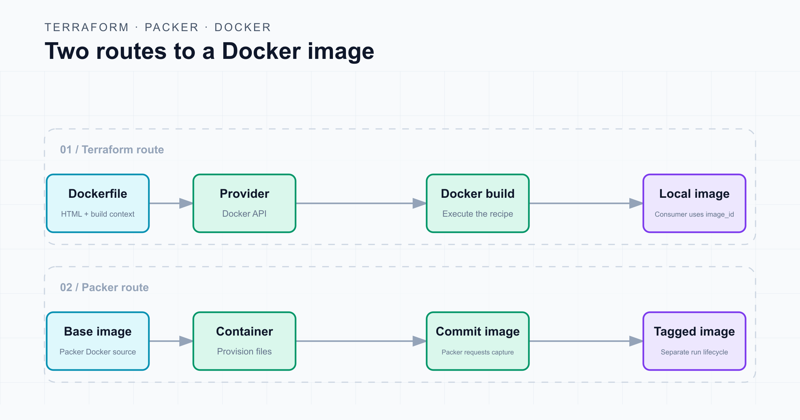
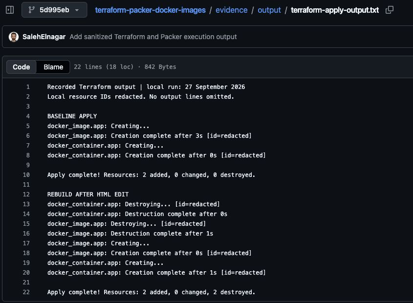
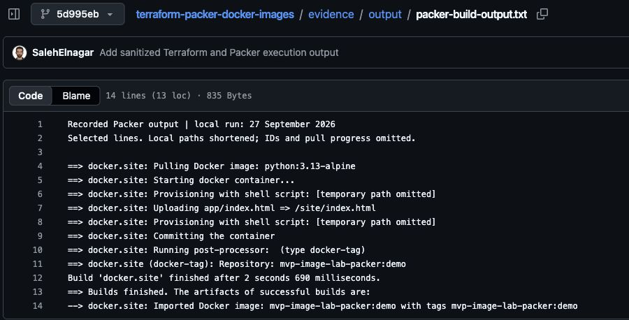
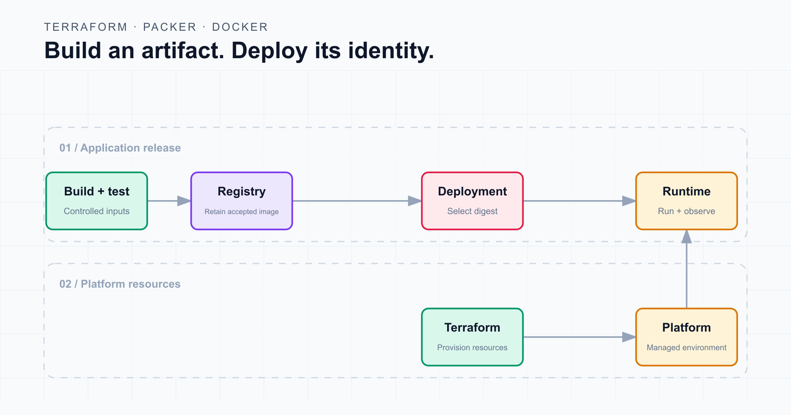

# Building Docker Images with Terraform and Packer: A Technical Walkthrough

“Wait… why is there a Docker image build in this Terraform configuration?”

Imagine that question coming up during a code review. The reviewer expects networks, compute, and permissions. Instead, they find a `docker_image` resource with a `build` block. Then a Packer template appears, and another question follows: “Isn't Packer for VM images?”

Both questions deserve a technical answer. Terraform's Docker provider can initiate an image build. Packer can provision a temporary container and capture it as an image. Docker performs the underlying container operations in both paths.

We will use one small web page to examine the two implementations, the dependency between an image and its container, and the source changes that should cause a rebuild. Then we will separate what is convenient for a local lab from what belongs in an application delivery pipeline.

**Evidence scope:** the local Docker demonstrations below were executed on 27 September 2026. The screenshots show sanitized Terraform and Packer output from those runs, viewed in the companion repository. Runtime checks are available separately. The Azure section is a proposed architecture; no image has been pushed to a registry.

**Run the examples:** the [companion GitHub repository](https://github.com/SalehElnagar/terraform-packer-docker-images) contains both implementations, the omitted-trigger experiment, a runtime verifier, and the recorded evidence.

## Two build paths, one application



*Two alternative implementations. Terraform and Packer are not both required to build the same image.*

The Terraform path keeps an image resource and its consuming container in one dependency graph. The Packer path finishes at a tagged image; running that image is a separate operation.

The Docker provider documents `build`, `triggers`, and `image_id`. Packer documents its provision-and-commit workflow through the Docker builder. [Docker provider 4.6.0](https://github.com/kreuzwerker/terraform-provider-docker/blob/v4.6.0/docs/resources/image.md), [Packer Docker builder](https://developer.hashicorp.com/packer/integrations/hashicorp/docker/latest/components/builder/docker).

## The lab and its limits

The reference environment is macOS with Docker Desktop running Linux containers. The Terraform example pins Terraform 1.14.7 and `kreuzwerker/docker` 4.6.0. The Packer run used CLI 1.14.3 and Docker plugin 1.1.4.

Use a disposable local daemon. The example names are reserved for the lab, and the HTTP port is published only on loopback. No registry push or Azure deployment is needed. The recorded run used Docker client 29.4.3, server 29.6.2, and BuildKit 0.31.2. Other host combinations need their own checks.

The files are arranged as follows:

```text
terraform-packer-docker/
  app/
    Dockerfile
    index.html
    .dockerignore
  terraform/
    main.tf
    .terraform.lock.hcl
  packer/
    site.pkr.hcl
```

The moving base-image tag keeps the recipe readable. It does not guarantee identical output on a later build. Use an approved digest and a controlled update process when artifact reproducibility matters. [Docker build best practices](https://docs.docker.com/build/building/best-practices/).

## 1. Give both implementations the same page

Create `app/index.html`:

```html
<!doctype html>
<html lang="en">
<meta charset="utf-8">
<title>Image build lab</title>
<h1>Image build lab: version one</h1>
</html>
```

The Dockerfile copies that page into `/site` and starts an HTTP server on port 8080:

```dockerfile
FROM python:3.13-alpine
WORKDIR /site
COPY index.html /site/index.html
USER 10001:10001
EXPOSE 8080
CMD ["python", "-m", "http.server", "8080", "--bind", "0.0.0.0", "--directory", "/site"]
```

`COPY` bakes the file into the image. There is no bind mount connecting it to the working directory. `USER` chooses a numeric non-root identity for the runtime process. `EXPOSE` documents the intended container port; the Terraform resource below controls host-port publication. [Dockerfile reference](https://docs.docker.com/reference/dockerfile/).

Python's HTTP server keeps the demonstration small. It is not a production server. [Python documentation](https://docs.python.org/3.13/library/http.server.html).

Limit the build context with `app/.dockerignore`:

```text
*
!Dockerfile
!index.html
!.dockerignore
```

The allowlist makes the local inputs easy to inspect. Docker removes ignored files from the build context before sending it to the builder. [Build context documentation](https://docs.docker.com/build/concepts/context/).

## 2. Let Terraform manage the image and its consumer

The complete `terraform/main.tf` is:

```hcl
terraform {
  required_version = "= 1.14.7"

  required_providers {
    docker = {
      source  = "kreuzwerker/docker"
      version = "= 4.6.0"
    }
  }
}

variable "docker_host" {
  description = "Explicit local Unix socket for the disposable lab Docker daemon."
  type        = string

  validation {
    condition     = startswith(var.docker_host, "unix:///")
    error_message = "Use a local Unix socket; remote Docker targets are outside this lab."
  }
}

provider "docker" {
  host = var.docker_host
}

resource "docker_image" "app" {
  name = "mvp-image-lab-terraform:demo"

  build {
    context = "${path.module}/../app"
  }

  triggers = {
    dockerfile = filesha256("${path.module}/../app/Dockerfile")
    content    = filesha256("${path.module}/../app/index.html")
    ignore     = filesha256("${path.module}/../app/.dockerignore")
  }
}

resource "docker_container" "app" {
  name          = "mvp-image-lab-terraform"
  image         = docker_image.app.image_id
  read_only     = true
  security_opts = ["no-new-privileges:true"]

  capabilities {
    drop = ["ALL"]
  }

  ports {
    internal = 8080
    external = 18080
    ip       = "127.0.0.1"
  }
}
```

There are three relationships to notice.

**The provider selects the daemon.** The input requires a local Unix socket, making the target explicit. This check limits the accepted URI shape; it is not a sandbox for Docker itself.

**The image resource declares the build.** The context points to `app`, and the trigger map hashes the Dockerfile, page, and ignore rules. A changed trigger requests replacement of the image resource.

**The container consumes `image_id`.** Terraform can infer the dependency from the reference. This is the Docker image identifier, rather than the Terraform resource's own `id`. [Image resource schema](https://github.com/kreuzwerker/terraform-provider-docker/blob/v4.6.0/docs/resources/image.md), [container resource schema](https://github.com/kreuzwerker/terraform-provider-docker/blob/v4.6.0/docs/resources/container.md).

The container configuration also requests a read-only filesystem, drops Linux capabilities, and disables privilege gains. Those settings are part of this small example, not a complete container-security baseline.

## 3. Inspect the plan before running the build

From the lab directory, select the intended Docker Desktop context and initialize the configuration:

```bash
export TF_VAR_docker_host="$(docker context inspect desktop-linux --format '{{.Endpoints.docker.Host}}')"
terraform -chdir=terraform init -backend=false -input=false
terraform -chdir=terraform validate
terraform -chdir=terraform plan -out=article-baseline.tfplan
```

Check that the selected endpoint is the intended local socket before planning. The initial plan reported **two additions, zero changes, and zero destroys**: the image and its container. Applying that reviewed plan created both resources.

Once that exact plan is reviewed and approved, the execution commands are:

```bash
terraform -chdir=terraform apply article-baseline.tfplan
curl --fail http://127.0.0.1:18080/
```

The request returned HTTP 200 and `Image build lab: version one`. Docker readback confirmed the non-root user, read-only root filesystem, dropped capabilities, no-new-privileges, absence of mounts, and loopback-only port.

A saved plan identifies planned resource actions. It does not embed and freeze every external file a provider might use during apply. Keep the build context at the reviewed revision through execution.

## 4. Change the source and explain the rebuild

Change the HTML heading from `version one` to `version two`. Request the page before running Terraform again.

The existing container still served version one. Changing the source file on the host did not rewrite the file inside the already-built image.

Now create a new plan:

```bash
terraform -chdir=terraform plan -out=article-update.tfplan
```

The new plan changed only the `content` hash in the trigger map and proposed replacing the image and its container. Applying the reviewed update replaced both resources. Docker reported a different image ID, and HTTP returned version two.



*Recorded Terraform apply output, viewed in GitHub. The baseline adds two resources; the rebuild adds two and destroys two. Local resource IDs are redacted.*

The negative experiment used a separate baseline, state directory, resource names, and port 18082. Only the `content` trigger was omitted. After changing its HTML to version two, the plan reported no changes and HTTP still returned version one. Removing a trigger midway through the positive experiment would itself change the map.

This is why “Terraform builds the image” is an incomplete explanation. The configuration must also express the inputs that tell Terraform when another build is needed.

For a larger application, review the complete build context, dependency locks, build arguments, and external inputs. Hashing the Dockerfile alone misses application changes. Hashing local files still does not pin a mutable base image or a package downloaded during a build.

## 5. Build the same page with Packer

Packer uses a different construction process: start a temporary container, provision it, commit the result, and tag the image.

Here is the complete `packer/site.pkr.hcl`:

```hcl
packer {
  required_plugins {
    docker = {
      source  = "github.com/hashicorp/docker"
      version = "= 1.1.4"
    }
  }
}

source "docker" "site" {
  image  = "python:3.13-alpine"
  commit = true

  changes = [
    "WORKDIR /site",
    "USER 10001:10001",
    "EXPOSE 8080",
    "ENTRYPOINT [\"python\"]",
    "CMD [\"-m\", \"http.server\", \"8080\", \"--bind\", \"0.0.0.0\", \"--directory\", \"/site\"]"
  ]
}

build {
  sources = ["source.docker.site"]

  provisioner "shell" {
    inline = ["mkdir -p /site && chmod 755 /site"]
  }

  provisioner "file" {
    source      = "${path.root}/../app/index.html"
    destination = "/site/index.html"
  }

  provisioner "shell" {
    inline = ["chmod 644 /site/index.html"]
  }

  post-processor "docker-tag" {
    repository = "mvp-image-lab-packer"
    tags       = ["demo"]
  }
}
```

The shell provisioner creates `/site`. The file provisioner uploads the page. A final permission change makes it readable by the runtime user. The `changes` list sets the image's runtime metadata. It explicitly selects Python as the entrypoint and puts the server arguments in `CMD`. The tag post-processor gives the result its local name. [File provisioner](https://developer.hashicorp.com/packer/docs/provisioners/file), [shell provisioner](https://developer.hashicorp.com/packer/docs/provisioners/shell), [Docker image metadata](https://developer.hashicorp.com/packer/integrations/hashicorp/docker/latest/components/builder/docker), [tag post-processor](https://developer.hashicorp.com/packer/integrations/hashicorp/docker/latest/components/post-processor/docker-tag).

Run Packer against the same intended local Docker environment:

```bash
packer init packer/site.pkr.hcl
packer validate packer/site.pkr.hcl
packer build packer/site.pkr.hcl

docker run -d --name mvp-image-lab-packer \
  --read-only --cap-drop=ALL --security-opt no-new-privileges:true \
  -p 127.0.0.1:18081:8080 mvp-image-lab-packer:demo

curl --fail http://127.0.0.1:18081/
```

The Packer container returned HTTP 200 and the version-one page captured at build time. This path does not read the Dockerfile. Editing the page requires another explicit build.



*Recorded Packer build output, viewed in GitHub. It shows provisioning, commit, and the local image tag. This excerpt omits IDs and pull progress and shortens local paths; it does not show a registry push.*

**A build success hid a runtime failure.** The first Packer recipe used `ENTRYPOINT []`. In this environment the committed image retained `/bin/sh`. The build succeeded, but the container exited with code 2 and `/bin/sh: can't open 'python': No such file or directory`.

The corrected recipe above sets an explicit Python entrypoint. The rebuilt image passed the HTTP and runtime checks. That is why image inspection and execution belong in the demonstration.

The Terraform and Packer images had different configuration IDs while serving the same initial page. Matching behavior does not imply byte-identical artifacts. These local image IDs are also distinct from registry manifest digests.

## 6. Decide what the extra tool buys you

Terraform provides resource tracking, planning, and dependencies. Docker Compose already offers declarative services, networks, and volumes. For a few local services, I would usually start with Compose. Terraform becomes more useful when the environment also spans infrastructure managed through other providers. [Terraform state](https://developer.hashicorp.com/terraform/language/state), [Compose application model](https://docs.docker.com/compose/intro/compose-application-model/).

Packer becomes interesting when a platform team already maintains provisioning scripts for image creation and can reuse appropriate parts across targets. That reuse needs testing: VM provisioning assumptions do not automatically fit containers.

For a straightforward application Dockerfile, I would normally keep the build in CI. Docker's build tooling supplies Buildx and BuildKit; adding Packer should address a specific provisioning need. [Docker Build architecture](https://docs.docker.com/build/concepts/overview/), [Docker in CI](https://docs.docker.com/build/ci/).

## 7. Make the release handoff an image digest



*Proposed delivery design, not a deployed result from this lab.*

For an Azure application, I would separate four responsibilities:

- **Build:** create the image, run the required checks, and publish the accepted artifact.
- **Provision:** use Terraform for the registry, networking, identities, and container platform.
- **Release:** let one designated workflow select the approved image digest and update the deployment configuration.
- **Operate:** let the runtime platform handle execution and scaling, while monitoring checks application health.

Azure Container Apps supplies managed runtime and scaling behavior. Terraform describes resource changes; its ordinary CLI does not continuously repair the application between runs. [Azure Container Apps](https://learn.microsoft.com/en-us/azure/container-apps/overview), [Terraform planning](https://developer.hashicorp.com/terraform/cli/commands/plan).

A registry digest identifies an artifact. A mutable tag can point to different content later. Retain the deployed artifact so promotion and recovery do not depend on rebuilding it. [Azure Container Registry versioning guidance](https://learn.microsoft.com/en-us/azure/container-registry/container-registry-image-tag-version).

A digest does not certify security, and selecting an older image does not undo incompatible database changes. It gives the deployment process a precise artifact identity to work with.

## Verify more than the screenshot

The companion lab includes a read-only verifier:

```bash
python3 scripts/verify-runtime.py --container mvp-image-lab-packer \
  --port 18081 --source app/index.html
```

Use the source file that was present when that image was built. The verifier compares the full HTTP response with its bytes, then checks the process, runtime user, filesystem mode, capabilities, privilege setting, mounts, and port mapping. It returned a failing exit status when deliberately given stale source bytes, while the other nine checks passed.

The evidence package keeps the failure as well as the passing runs. Screenshots help readers see the result; the checks explain precisely what was verified.

## What I would ask in that code review

Before approving an image build inside Terraform, I would trace one application change: which input causes a rebuild, which artifact gets tested, and which exact artifact reaches the runtime?

Then I would check ownership. If CI builds the image and Terraform deploys it, the image reference needs a clear handoff. If another deployment workflow owns that setting, Terraform should not independently compete for it.

Terraform-driven builds can be useful in a bounded environment. Packer can reuse an established image-provisioning workflow. A conventional Docker build in CI may be the simplest choice for the application.

Choose the arrangement whose inputs, artifacts, and operating responsibilities you can explain and verify.
