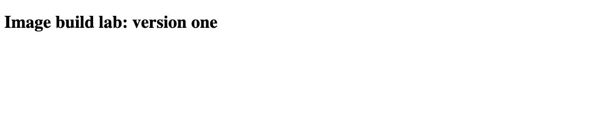
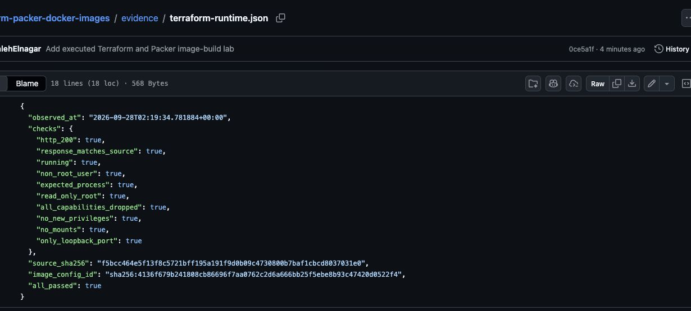

# Recorded local evidence

These are observations from the local run on 2026-09-27 (America/Toronto).
Tool versions and source/screenshot hashes are in [manifest.json](manifest.json).
No cloud deployment, hosted CI run, or registry push is claimed.

| Case | Observed result |
|---|---|
| Terraform baseline | HTTP 200; version one; expected runtime settings |
| Edit without rebuilding | Source version two; running response still version one |
| Terraform rebuild | Image changed; HTTP 200; version two |
| Omitted content trigger | HTML changed; no-op plan; HTTP still version one |
| Initial Packer image | Build succeeded; runtime exited 2 with the inherited shell entrypoint |
| Repaired Packer image | Explicit Python entrypoint; HTTP 200; ten runtime checks passed |

The JSON files contain selected, sanitized observations rather than raw Docker
inspect output, Terraform state, plans, or build logs. Image configuration IDs
identify local image configurations; they are not registry manifest digests.

## Real browser captures

### Terraform baseline

Captured from `http://127.0.0.1:18080/` after the baseline apply.

### Source edited, image unchanged

Captured from the same endpoint after editing the source and before applying a
new build. The screenshot alone does not prove the source changed; the paired
observation and input fixture supply that context.

### Terraform rebuild

Captured from the same endpoint after image and container replacement.

### Omitted-trigger case

Captured from `http://127.0.0.1:18082/`. The associated JSON records the no-op
plan after changing its source to version two.

### Packer runtime

Captured from `http://127.0.0.1:18081/`. The runtime verification checks the
process and settings that a page screenshot cannot establish.

The captures are cropped browser screenshots, not generated examples or
reconstructed terminal output. They show exactly the served page. They do not
prove that every possible behavior works.

## Runtime verification report

Actual browser capture of the report generated against the running Terraform container.
